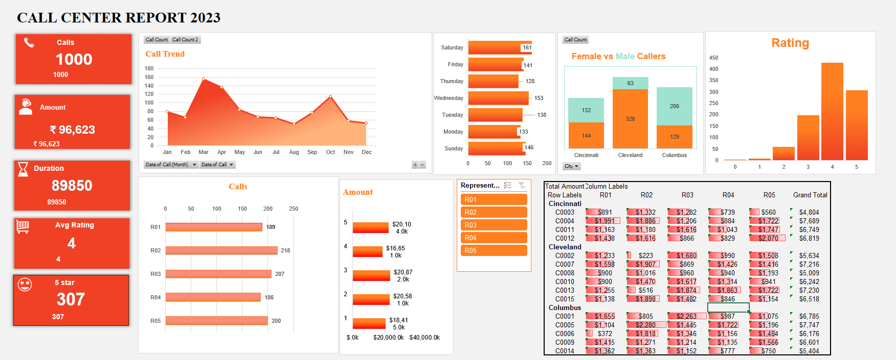

# 📞 Call Center Performance Dashboard

## Project Overview

This project presents an interactive Call Center Performance Dashboard developed in Microsoft Excel to analyze customer service operations and support data-driven decision making.

The dashboard provides visibility into key operational metrics such as customer satisfaction, call volume, purchase amount, call duration, and representative performance.

The objective was to transform raw call center data into meaningful business insights through data cleaning, aggregation, visualization, and KPI reporting.

---

## Business Problem

Call centers generate large volumes of customer interaction data, making it difficult for management to monitor performance and identify improvement opportunities.

This dashboard was created to:

- Monitor customer service performance
- Track customer satisfaction levels
- Identify high-value customers
- Analyze call trends over time
- Support operational decision-making

---

## Dataset Information

The dataset contains customer service interaction records including:

- Customer Name
- Representative Name
- Call Duration
- Satisfaction Rating
- Purchase Amount
- Date of Interaction

The data was cleaned, structured, and analyzed using Microsoft Excel.

---

## Tools & Techniques Used

### Microsoft Excel

- Pivot Tables
- Pivot Charts
- Slicers
- Conditional Formatting
- KPI Reporting
- Data Cleaning
- Dashboard Design

---

## Key Performance Indicators (KPIs)

The dashboard tracks:

- Total Calls
- Total Purchase Amount
- Average Satisfaction Rating
- Average Call Duration
- Top Customers
- Representative Performance
- Monthly Trends

---

## Dashboard Features

### Executive Dashboard

Provides a high-level overview of business performance through KPI cards and visual reports.

### Customer Analysis

Analyzes customer purchasing behavior and satisfaction ratings.

### Representative Performance Analysis

Evaluates employee productivity and service quality.

### Monthly Trend Analysis

Tracks call activity and performance metrics over time.

### Interactive Filtering

Users can filter dashboard views using slicers for deeper analysis.

---

## Key Business Insights

- Identified top-performing customer service representatives.
- Highlighted customers generating the highest purchase value.
- Monitored satisfaction trends across customer interactions.
- Evaluated call duration patterns and operational efficiency.
- Analyzed monthly performance fluctuations.

---

## Dashboard Screenshots

### Main Dashboard

### Customer Analysis

### Interactive Filter 

### Monthly Trends

---

## Project Files

- Call Center Report 2023.xlsx

---

## Skills Demonstrated

- Business Analysis
- Data Analysis
- Dashboard Development
- KPI Reporting
- Data Visualization
- Excel Analytics
- Performance Monitoring
- Decision Support Reporting

---

## Author

### Sara Chandana Priya

Business Analyst | SQL | Power BI | Excel | Data Analytics

LinkedIn: https://linkedin.com/in/chandanapriya141
